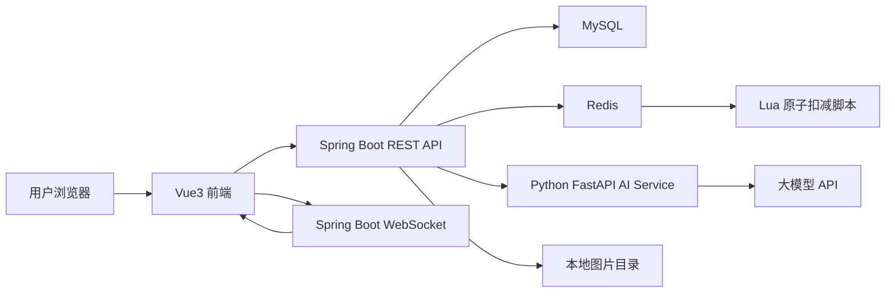
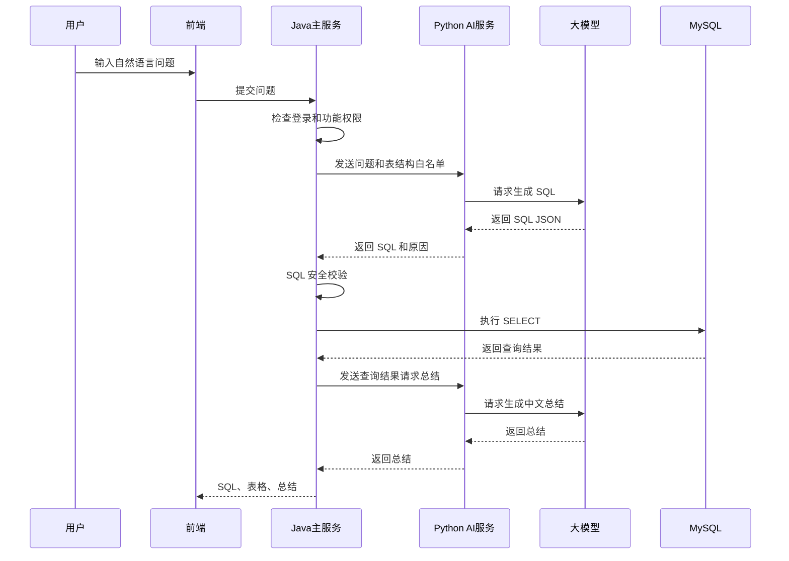
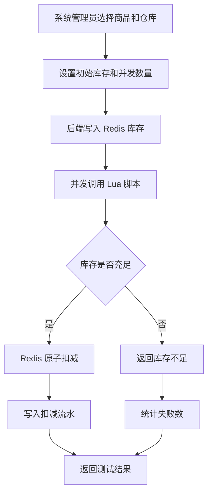

# 商品进销存管理系统概要设计

## 1. 设计目标

本系统以两周内完成可运行 MVP 为目标，围绕商品进销存核心流程建设，同时保留三个技术亮点：大模型 Text-to-SQL、Redis 防超卖扣减、WebSocket 实时库存大屏。

设计原则：

- 基础功能保持轻量，只覆盖项目演示必需的业务闭环。
- 权限采用两个固定角色，不做复杂权限配置系统。
- 商品图片支持多图上传、主图展示和详情图库。
- Text-to-SQL 接入大模型，但必须限制查询范围并做 SQL 安全校验。
- Redis 防超卖模块以并发测试形式演示技术能力。
- WebSocket 大屏展示实时库存变化和预警事件。
- 后端采用 Java + Python 双服务，Spring Boot 承担主业务，Python 承担大模型 Text-to-SQL 能力。

## 2. 技术架构

### 2.1 技术选型

Java 主服务：

- Java
- Spring Boot
- Spring Security 或 JWT 自定义认证
- MyBatis-Plus
- MySQL
- Redis
- Lua 脚本
- Spring WebSocket

Python AI 服务：

- Python
- FastAPI
- 大模型 API 客户端
- Prompt 构建
- SQL JSON 生成
- 查询结果中文总结

前端：

- Vue3
- Element Plus
- ECharts
- Axios
- WebSocket 客户端

数据库与中间件：

- MySQL：核心业务数据。
- Redis：高并发库存扣减演示。
- 本地文件目录：商品图片上传存储。
- 大模型 API：Text-to-SQL SQL 生成与结果总结。

### 2.2 总体架构



### 2.3 分层设计

Java 主服务分为 5 层：

- API 层：接收 HTTP/WebSocket 请求，做参数校验和权限校验。
- Service 层：处理业务逻辑，例如入库、出库、库存更新、Redis 防超卖和 Text-to-SQL 编排。
- Repository 层：封装数据库查询和写入。
- Integration 层：封装 Redis、Python AI 服务调用、图片存储等外部能力。
- Common 层：封装认证、权限、异常、日志、SQL 安全校验等公共逻辑。

Python AI 服务分为 4 层：

- API 层：接收 Java 主服务请求。
- Prompt 层：构建 Text-to-SQL 提示词和总结提示词。
- LLM Client 层：调用大模型 API。
- Response Parser 层：解析大模型 JSON 输出，返回 SQL 和解释。

前端分为 5 类页面：

- 登录页。
- 基础管理页：用户、商品、仓库。
- 业务操作页：入库、出库、库存查询、报表。
- 特色功能页：Text-to-SQL、防超卖测试。
- 实时大屏页。

## 3. 功能模块设计

### 3.1 登录与权限模块

系统包含两个角色：

- 系统管理员：拥有全部功能权限。
- 仓库管理员：负责入库、出库、库存查询、报表、Text-to-SQL 和实时大屏。

登录流程：

1. 用户输入用户名和密码。
2. 后端校验账号状态和密码。
3. 后端签发 token。
4. 前端保存 token 和角色信息。
5. 前端根据角色渲染菜单。
6. 后端接口根据角色做二次权限校验。

权限矩阵：

| 功能 | 系统管理员 | 仓库管理员 |
|---|---:|---:|
| 用户管理 | 是 | 否 |
| 商品管理 | 是 | 查看 |
| 仓库管理 | 是 | 查看 |
| 入库管理 | 是 | 是 |
| 出库管理 | 是 | 是 |
| 库存查询 | 是 | 是 |
| 简单报表 | 是 | 是 |
| Text-to-SQL | 是 | 是 |
| Redis 防超卖测试 | 是 | 否 |
| WebSocket 大屏 | 是 | 是 |

### 3.2 商品管理模块

商品管理负责维护商品基础信息和商品图片。

核心能力：

- 新增商品。
- 修改商品。
- 停用商品。
- 查询商品。
- 上传多张商品图片。
- 设置商品主图。
- 商品列表展示主图。
- 商品详情展示图库。

图片处理规则：

- 每个商品最多上传 5 张图片。
- 支持 JPG、PNG。
- 后端保存图片到本地上传目录。
- 数据库保存图片 URL、是否主图和排序值。
- 如果用户没有指定主图，默认第一张图片为主图。

### 3.3 仓库管理模块

仓库管理负责维护多仓基础信息。

核心能力：

- 新增仓库。
- 修改仓库。
- 停用仓库。
- 查询仓库。

第一版建议初始化 3 个仓库：

- 北京仓。
- 上海仓。
- 广州仓。

### 3.4 入库管理模块

入库用于增加商品库存。

处理流程：

1. 用户选择商品、仓库、数量和备注。
2. 系统生成入库单号。
3. 系统查询当前库存。
4. 系统增加库存。
5. 系统写入入库记录。
6. 系统写入库存流水。
7. 系统通过 WebSocket 推送库存变化事件。

事务要求：

- 入库记录、库存更新、库存流水必须在同一事务中完成。

### 3.5 出库管理模块

出库用于扣减商品库存。

处理流程：

1. 用户选择商品、仓库、数量和备注。
2. 系统查询当前库存。
3. 如果库存不足，拒绝出库。
4. 如果库存充足，系统生成出库单号。
5. 系统扣减库存。
6. 系统写入出库记录。
7. 系统写入库存流水。
8. 如果库存低于安全库存，生成预警事件。
9. 系统通过 WebSocket 推送库存变化和预警事件。

事务要求：

- 出库记录、库存更新、库存流水必须在同一事务中完成。

### 3.6 库存查询与报表模块

库存查询：

- 按商品查询库存。
- 按仓库查询库存。
- 查询低库存商品。
- 查询商品多仓库存分布。

简单报表：

- 商品库存排行。
- 最近 7 天出库排行。
- 各仓库库存总量。
- 低库存商品列表。

报表第一版通过 SQL 聚合实现，不单独建设报表系统。

## 4. 特色功能设计

### 4.1 大模型 Text-to-SQL

#### 4.1.1 功能目标

用户输入中文业务问题，Java 主服务调用 Python AI 服务生成 SQL，Java 主服务执行安全校验，通过后查询 MySQL，并返回查询结果和中文总结。

#### 4.1.2 调用流程



#### 4.1.3 可查询范围

允许查询：

- 商品表。
- 商品图片主图。
- 仓库表。
- 当前库存表。
- 入库记录表。
- 出库记录表。
- 库存流水表。

禁止查询：

- 用户密码。
- token。
- 非白名单表。
- 任何修改类语句。

#### 4.1.4 SQL 安全策略

Java 主服务必须执行以下校验：

- SQL 去除前后空白后必须以 `SELECT` 开头。
- 禁止出现 `INSERT`、`UPDATE`、`DELETE`、`DROP`、`ALTER`、`TRUNCATE`。
- 禁止分号多语句。
- 禁止查询非白名单表。
- 必须包含 `LIMIT`，否则自动补充 `LIMIT 20`。
- 最大返回 20 条。

#### 4.1.5 Prompt 设计要点

Prompt 应包含：

- 数据表结构说明。
- 表之间关系。
- 允许查询的表。
- 禁止生成修改类 SQL。
- 必须返回 JSON。
- 用户问题。

大模型返回格式：

```json
{
  "sql": "SELECT ... LIMIT 20",
  "reason": "解释为什么生成这个 SQL"
}
```

### 4.2 Redis 防超卖扣减

#### 4.2.1 功能目标

模拟高并发扣减同一商品库存，证明 Redis + Lua 可以保证“判断库存”和“扣减库存”的原子性，避免库存扣成负数。

#### 4.2.2 处理流程



#### 4.2.3 Redis Key 设计

- 库存 Key：`stock:{warehouse_id}:{product_id}`
- 请求去重 Key：`stock_req:{request_id}`

第一版可以只实现库存 Key；请求去重作为后续增强。

#### 4.2.4 Lua 逻辑

```text
读取库存
如果库存不存在，返回失败
如果库存小于扣减数量，返回库存不足
否则扣减库存并返回成功
```

### 4.3 WebSocket 实时大屏

#### 4.3.1 功能目标

入库、出库、低库存预警、Redis 扣减测试发生后，后端主动向前端推送事件，让大屏实时更新。

#### 4.3.2 推送事件类型

- `STOCK_IN`：入库。
- `STOCK_OUT`：出库。
- `LOW_STOCK_WARNING`：低库存预警。
- `REDIS_DEDUCT_RESULT`：Redis 防超卖测试结果。

#### 4.3.3 大屏展示内容

- 商品总数。
- 仓库总数。
- 当前库存总量。
- 低库存预警数量。
- 各仓库库存柱状图。
- 最近库存变动事件列表。
- 低库存商品列表。
- 热门商品主图和库存变化。

#### 4.3.4 消息格式

```json
{
  "eventType": "STOCK_OUT",
  "warehouseName": "北京仓",
  "productName": "埃塞俄比亚咖啡豆",
  "productImage": "/uploads/products/coffee-bean.png",
  "changeQuantity": 5,
  "currentStock": 18,
  "message": "北京仓的埃塞俄比亚咖啡豆出库 5 件，当前库存 18 件"
}
```

## 5. 接口模块划分

### 5.1 REST API 模块

以下接口由 Java Spring Boot 主服务提供：

- `/api/auth`：登录、当前用户信息。
- `/api/users`：用户管理。
- `/api/products`：商品管理。
- `/api/products/{id}/images`：商品图片管理。
- `/api/warehouses`：仓库管理。
- `/api/stock-in`：入库管理。
- `/api/stock-out`：出库管理。
- `/api/inventory`：库存查询。
- `/api/reports`：简单报表。
- `/api/nl-query`：Text-to-SQL。
- `/api/redis-deduct`：Redis 防超卖测试。
- `/api/dashboard`：大屏初始化数据。

Python AI 服务仅暴露给 Java 主服务调用，不直接提供给前端：

- `/ai/text-to-sql`：根据问题和表结构生成 SQL。
- `/ai/summarize-result`：根据查询结果生成中文总结。

### 5.2 WebSocket 接口

- `/ws/dashboard`：实时大屏事件推送。

## 6. 前端页面设计

页面清单：

- 登录页。
- 首页仪表盘。
- 用户管理页。
- 商品管理页。
- 商品详情页。
- 仓库管理页。
- 入库管理页。
- 出库管理页。
- 库存查询页。
- 简单报表页。
- Text-to-SQL 查询页。
- Redis 防超卖测试页。
- 多仓实时大屏页。

菜单权限：

- 系统管理员：显示所有菜单。
- 仓库管理员：隐藏用户管理、仓库编辑、Redis 防超卖测试。

## 7. 后端目录建议

```text
inventory-system/
  backend-java/
    src/main/java/com/example/inventory/
      controller/
        AuthController.java
        UserController.java
        ProductController.java
        WarehouseController.java
        StockInController.java
        StockOutController.java
        InventoryController.java
        ReportController.java
        NlQueryController.java
        RedisDeductController.java
        DashboardWebSocketHandler.java
      service/
      mapper/
      entity/
      dto/
      config/
      security/
      integration/
        PythonAiClient.java
        RedisDeductClient.java
        FileStorageService.java
      common/
        SqlGuard.java
  backend-python-ai/
    app/
      api/
        text_to_sql.py
        summarize.py
      core/
        config.py
        prompt.py
      integrations/
        llm_client.py
      schemas/
      main.py
```

## 8. 关键风险与控制

| 风险 | 控制方式 |
|---|---|
| Text-to-SQL 生成危险 SQL | Java 主服务执行白名单表、只读限制、关键词拦截、自动 LIMIT |
| 大模型调用失败 | 前端提示失败，不影响其他功能 |
| 双服务联调增加复杂度 | 前端只调用 Java，Python 只提供 AI 内部接口 |
| 图片上传占用时间过多 | 只做本地存储和多图路径保存 |
| Redis 模块过复杂 | 只做独立并发测试模块 |
| WebSocket 连接不稳定 | 前端自动重连，大屏也可拉取初始化数据 |
| 两周开发时间不足 | 先完成基础闭环，再做特色功能页面打磨 |

## 9. 开发优先级

优先级 P0：

- 登录与两角色权限。
- 商品管理和多图上传。
- 仓库管理。
- 入库、出库、库存查询。
- 库存流水。

优先级 P1：

- 大模型 Text-to-SQL。
- Redis 防超卖测试。
- WebSocket 大屏。

优先级 P2：

- 页面美化。
- 报表增强。
- 图片排序优化。
- 更丰富的自然语言问题。
